This guide walks you through installing an extention in SharePoint Online.

### Prereqs
- SharePoint administrator in the tenant where you like to get the SharePoint App (Add-In) implemented. 
- Have the [app].SPPKG file to be installed

## SharePoint admin center {#adm-center}

Navigate to your SharePoint admin center - either  located in the "Classic SharePoint admin center" 

```text
https://[yourtenant]-admin.sharepoint.com/_layouts/15/online/tenantadminapps.aspx
```

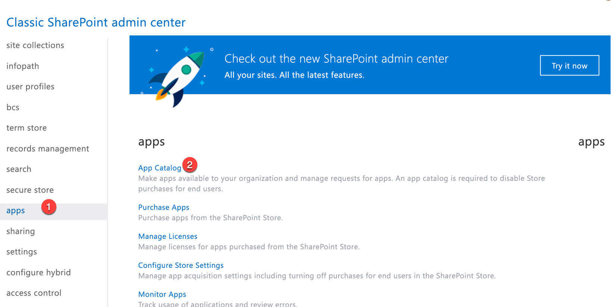

Or in "Classic features"

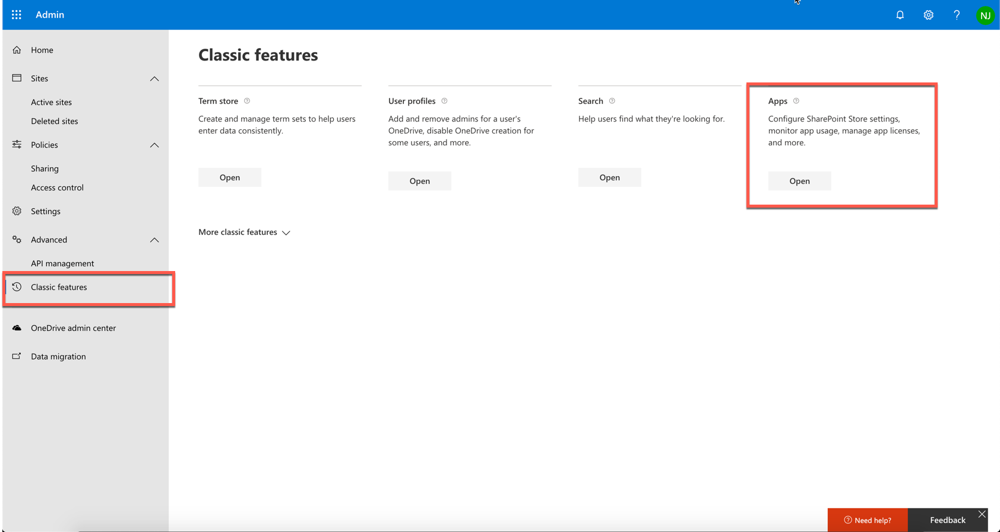

### App Catalog {#app-catalog}

If you haven't configured an App Catalog yet, check out this video to see how https://www.youtube.com/watch?v=xEc8X7VVtc8

Click on (1)

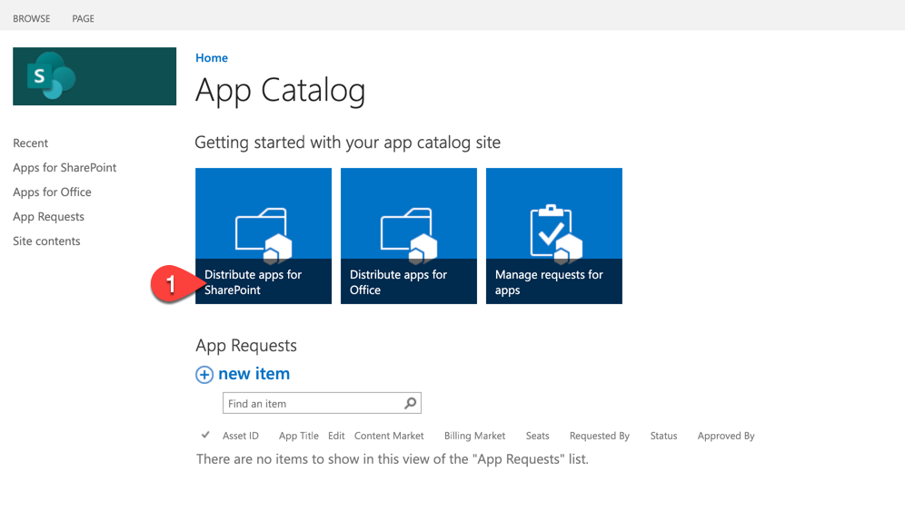

Click Upload

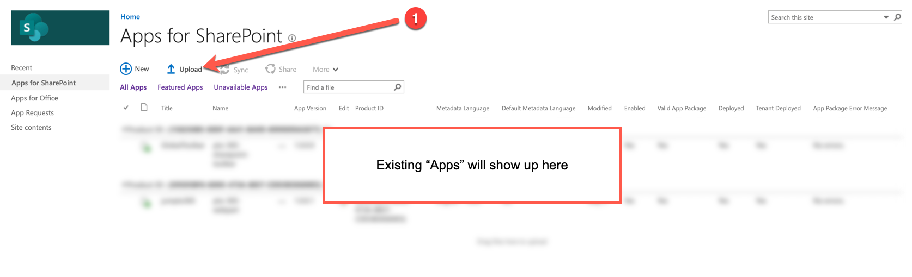

Upload the  [app].SPPKG file

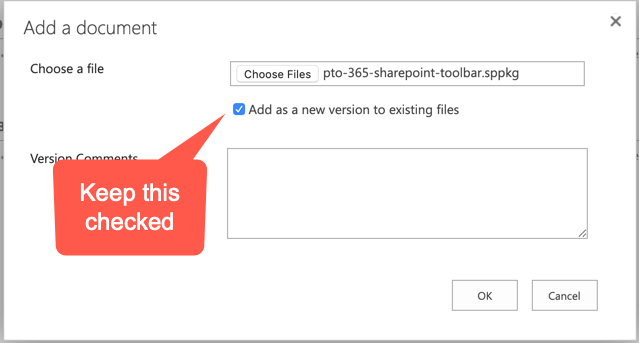

If the option dialog do not appear, then select "Deploy" in the Ribbon

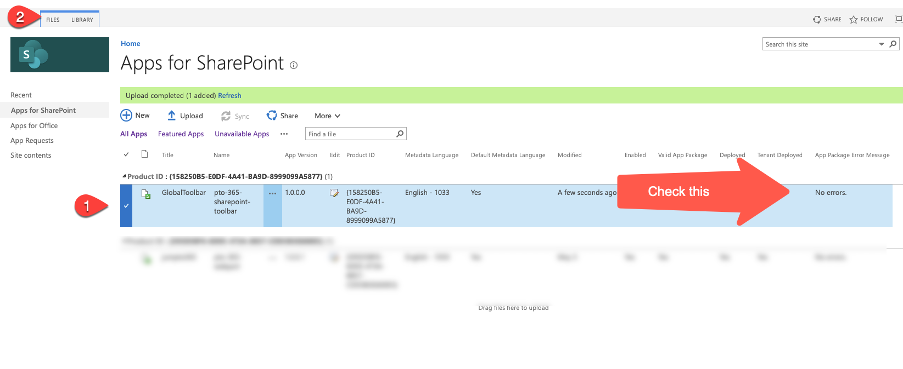

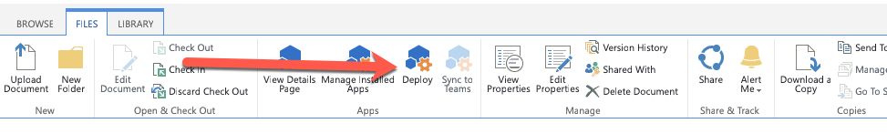

When the file has been uploaded, SharePoint will give you the option to "Make this solution available to all sites in the organization" or not. 

Disregard the following statement as the Toolbar is an extension. not a web part. 

> If you clear this setting, users won't be able to add the web part to pages. The web part will continue to work if it was already added to pages.

Instead, read more about   [Tenant-scoped solution deployment for SharePoint Framework solutions](https://docs.microsoft.com/en-us/sharepoint/dev/spfx/tenant-scoped-deployment)

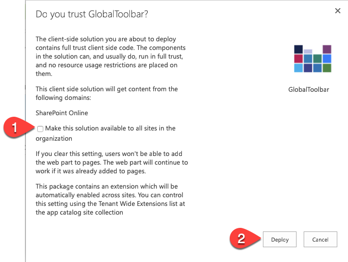

### Check deployment status {#deployment-status}

If you did select "Make this solution available to all sites in the organization" the extention will be available to all site collections in your tenant and the value in column "Tenant Deployed" will be Yes

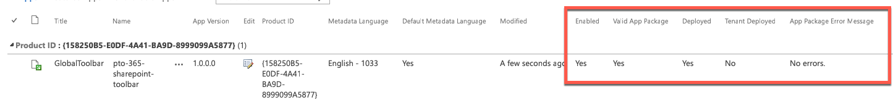

If you have just created the app catalog, you might see that the deployment failed. Check this to learn what to do https://support.shortpoint.com/support/solutions/articles/1000269130-known-issue-shortpoint-spfx-app-deployment-error-deployment-failed-correlation-id-guid-

## Install app in a specific site collection {#site-install}

If you did not select "Make this solution available to all sites in the organization" when you deployed the extention, you need to install the "App" individually on each site collection

Click the Cog then "Add an app" 

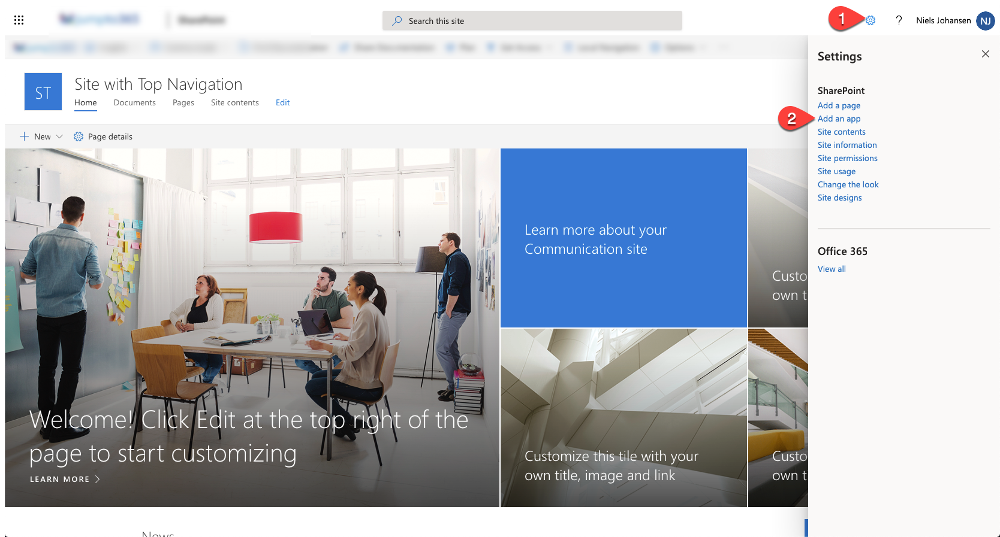

Select "From Your Organisation"

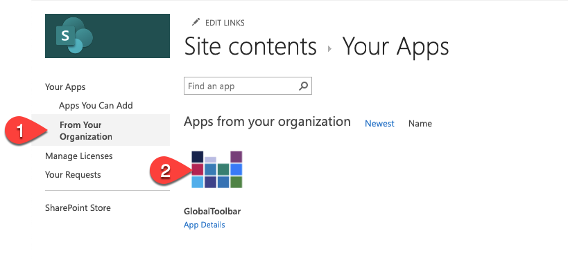

Wait a few seconds

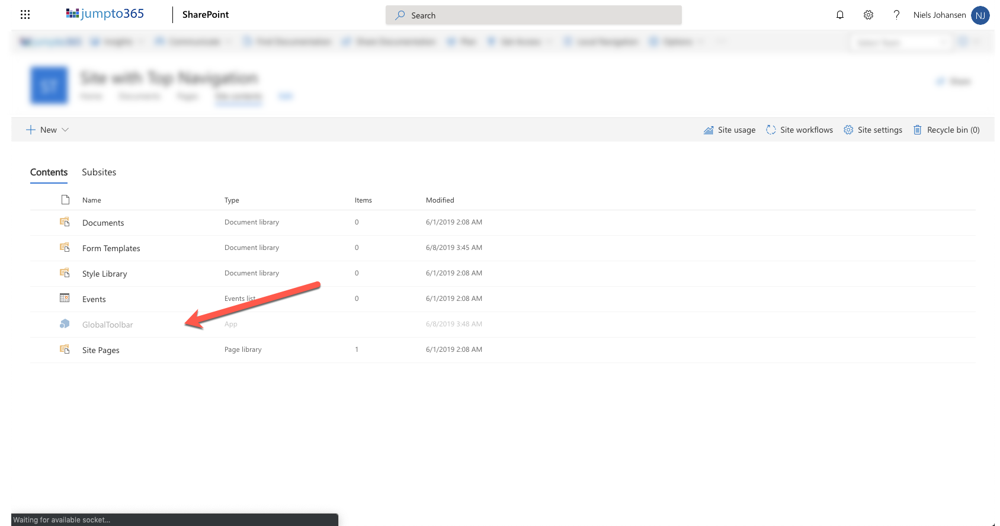

Refresh the page and verify the "GlobalToolbar" is no longer greyed out

## Remove app in a specific site collection {#app-remove}
Navigate to site content and local the "GlobalToolbar"

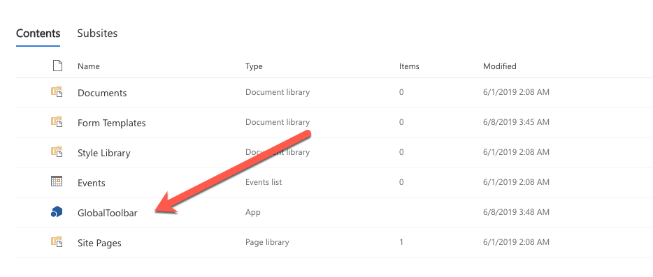

Click on the menu 

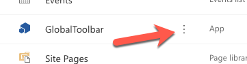

Select "Remove"

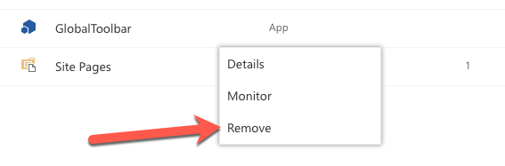

Accept that Microsoft might not have integrated this function in Modern, so click "Return to classic SharePoint". Note that this doesn't convert the current site to Classic.

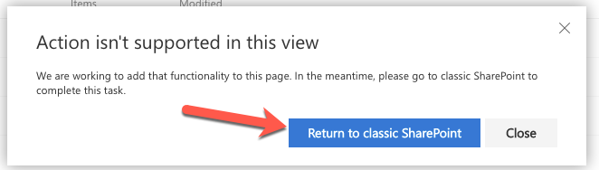

Select "Remove"

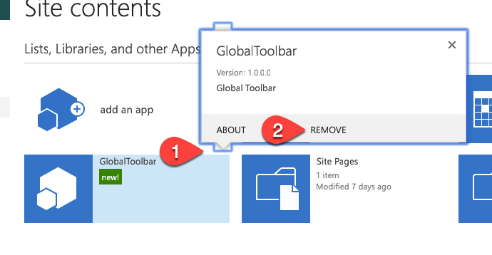

And finally OK

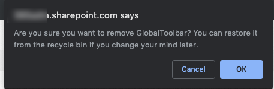