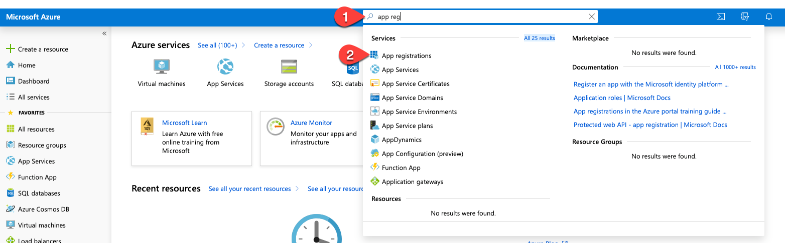
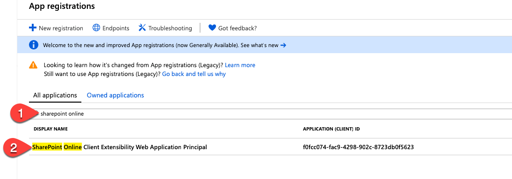
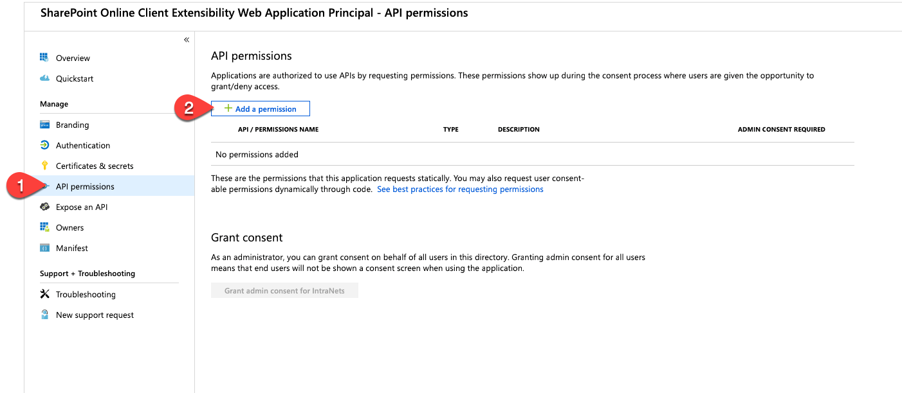
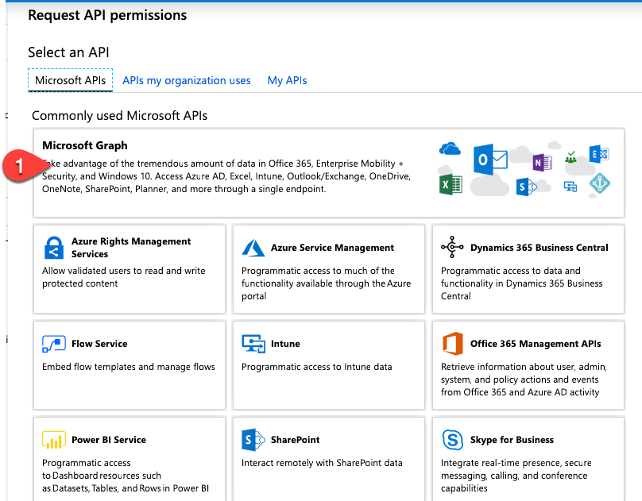
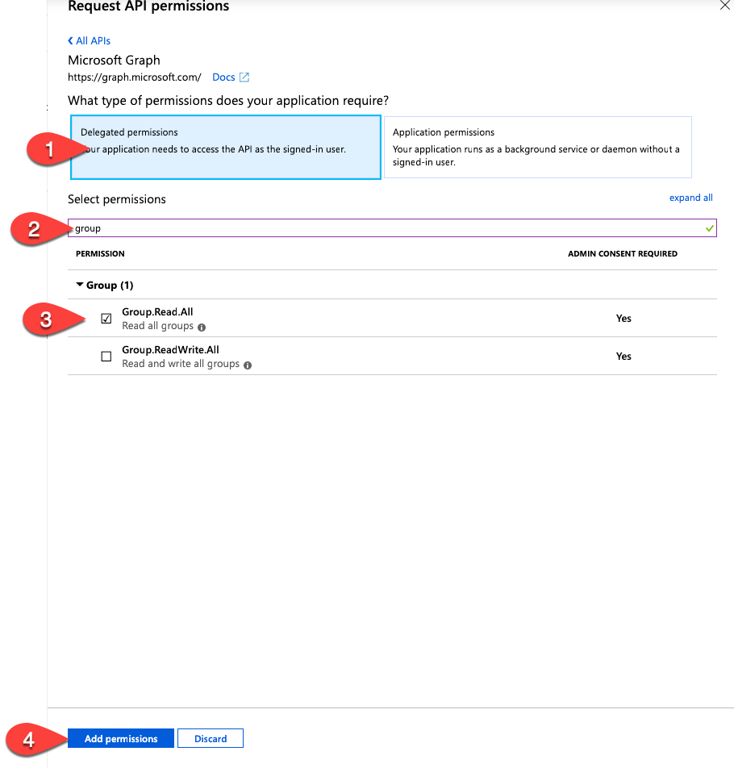
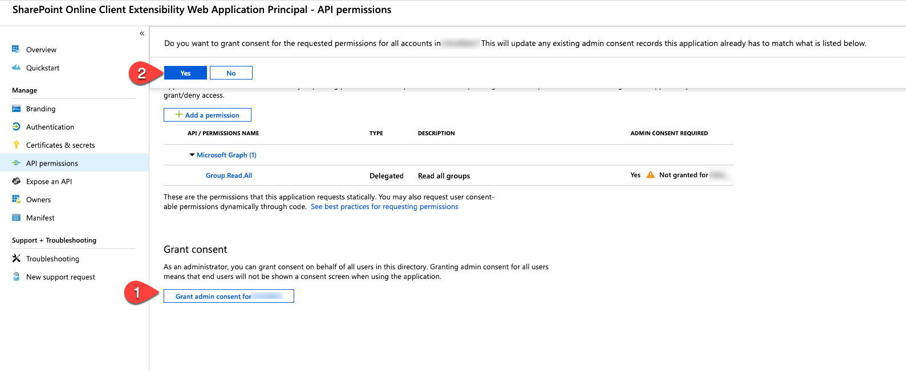

The App Package which you installed has been tailored to your specific tenant

If you like to enabled some of the integration features in the Global Nav specific to Office Graph, then you need to visit the Azure Portal at [https://portal.azure.com](https://portal.azure.com/) and consent to the permissions required.

https://portal.azure.com/#blade/Microsoft_AAD_RegisteredApps/ApplicationsListBlade

