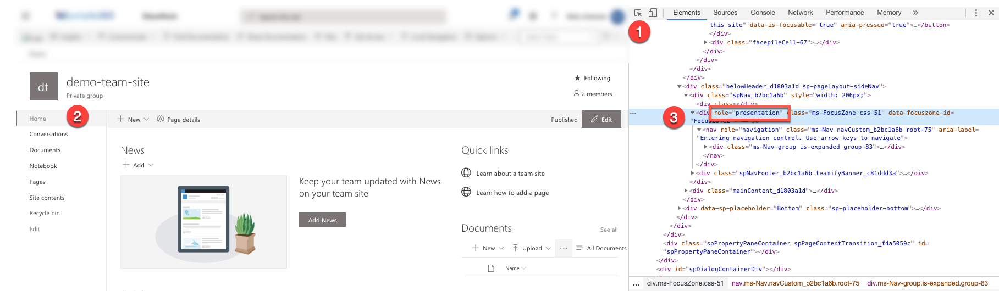

This receipt assume that you have installed the [SharePoint extentions](./extention-sharepoint.md)

The case is to apply page navigation elements like a tab and a expandable areas to the page in order to conform to UX advises. 

Before we dive into it, it is important to understand the anatomy of a "Modern Page". It is also worth mentioning that the teqniques used here is not supported by Microsoft.

## The anatomy of a SharePoint Modern Page

> Read more about [Modern Page Best Practices (SharePointMaven)](https://sharepointmaven.com/sharepoint-modern-page-best-practices/)  and [Branding SharePoint Modern Experience (Microsoft)](https://docs.microsoft.com/en-us/sharepoint/branding-sharepoint-online-sites-modern-experience)

A SharePoint Modern page consists of out

- Top menu
- Hub menu
- Site Header
- Command Bar
- Page Header
- 1 to many Page Sections
- Footer

## Step 1: Take Control over the Header {#masthead}
 
We use a technique called "document quering" to locate the elements of the page we want to control.

In this case we like to hide the standard SharePoint navigation elements. To do that, we need to be able to identify each of the elements by attributes typically. You can examine the DOM  using the Developer Tools in e.g. Chrome 



Repeat that for all elements you like to control.

- Top menu 
  [id="SuiteNavPlaceHolder"]

- Page Header 
  [data-automation-id="pageHeader"]

- Site Header
  [data-automation-id="pageHeader"]

- Sidebar (for Team sites)

  [role="presentation"]

Being able to identify the elements makes it possible to control the look by altering the style of the element. In this case we like to hide the element entirely which is done by setting "display" to "none".

Copy the following and paste it into the "global" part of your Page Script.

```javascript
var suiteNavPlaceHolder = document.querySelector('[id="SuiteNavPlaceHolder"]');
if (suiteNavPlaceHolder){
    suiteNavPlaceHolder.style.display="none"     
}

var pageHeader = document.querySelector('[data-automation-id="pageHeader"]');
if (pageHeader){
    pageHeader.style.display="none"     
}

var siteHeader = document.querySelector('[data-automationid="SiteHeader"]');
if (siteHeader){
    siteHeader.style.display="none"     
}
 var sideBar = document.querySelector('[role="presentation"]');
if (sideBar){
    sideBar.style.display="none"     
}
           
```


## Step 2: Remove unwanted styles

Lorem Ipsum is simply dummy text of the printing and typesetting industry. Lorem Ipsum has been the industry's standard dummy text ever since the 1500s, when an unknown printer took a galley of type and scrambled it to make a type specimen book. It has survived not only five centuries, but also the leap into electronic typesetting, remaining essentially unchanged. It was popularised in the 1960s with the release of Letraset sheets containing Lorem Ipsum passages, and more recently with desktop publishing software like Aldus PageMaker including versions of Lorem Ipsum

## Step 3: Add a Tab Controller

Lorem Ipsum is simply dummy text of the printing and typesetting industry. Lorem Ipsum has been the industry's standard dummy text ever since the 1500s, when an unknown printer took a galley of type and scrambled it to make a type specimen book. It has survived not only five centuries, but also the leap into electronic typesetting, remaining essentially unchanged. It was popularised in the 1960s with the release of Letraset sheets containing Lorem Ipsum passages, and more recently with desktop publishing software like Aldus PageMaker including versions of Lorem Ipsum

```html
<div style="display: flex; flex-wrap: wrap;">
  <div class="tab selected ">Tab 1</div>
  <div class="tab  ">Tab 2</div>
  <div class="tab  ">Tab 3</div>
  <div class="tab  ">Tab 4</div>
  <div class="tab  ">Tab 5</div>
</div>

```


```jsx
var tabs  =[
            { title: "Tab 1", ref: "1" },
            { title: "Tab 2", ref: "2" },
            { title: "Tab 3", ref: "3" },
            { title: "Tab 4", ref: "4" },
            { title: "Tab 5", ref: "5" }
          ]
  <div style={{ display: "flex", flexWrap: "wrap" }}>
            {tabs.map((tab, key) => {
              var isOver = this.state.over === key ? true : false;
              var isSelected = this.state.selected === key ? true : false;
              return (
                <div
                  onMouseEnter={() => {
                    this.setState({ over: key });
                  }}
                  onMouseLeave={() => {
                    this.setState({ over: "" });
                  }}
                  onClick={() => {
                    this.setState({ selected: key });
                    this.handleTabs(key);
                  }}
                  className={`tab ${isSelected ? "selected" : ""} ${
                    isOver && !isSelected ? "over" : ""
                  }`}
                  key={key}
                >
                  {tab.title}
                </div>
              );
            })}
          </div>

```

## Step 4: Tag "tab" sections

Lorem Ipsum is simply dummy text of the printing and typesetting industry. Lorem Ipsum has been the industry's standard dummy text ever since the 1500s, when an unknown printer took a galley of type and scrambled it to make a type specimen book. It has survived not only five centuries, but also the leap into electronic typesetting, remaining essentially unchanged. It was popularised in the 1960s with the release of Letraset sheets containing Lorem Ipsum passages, and more recently with desktop publishing software like Aldus PageMaker including versions of Lorem Ipsum

## Step 3: Add a Expand controller

Lorem Ipsum is simply dummy text of the printing and typesetting industry. Lorem Ipsum has been the industry's standard dummy text ever since the 1500s, when an unknown printer took a galley of type and scrambled it to make a type specimen book. It has survived not only five centuries, but also the leap into electronic typesetting, remaining essentially unchanged. It was popularised in the 1960s with the release of Letraset sheets containing Lorem Ipsum passages, and more recently with desktop publishing software like Aldus PageMaker including versions of Lorem Ipsum

## Step 4: Tag "expandable" sections


Lorem Ipsum is simply dummy text of the printing and typesetting industry. Lorem Ipsum has been the industry's standard dummy text ever since the 1500s, when an unknown printer took a galley of type and scrambled it to make a type specimen book. It has survived not only five centuries, but also the leap into electronic typesetting, remaining essentially unchanged. It was popularised in the 1960s with the release of Letraset sheets containing Lorem Ipsum passages, and more recently with desktop publishing software like Aldus PageMaker including versions of Lorem Ipsum